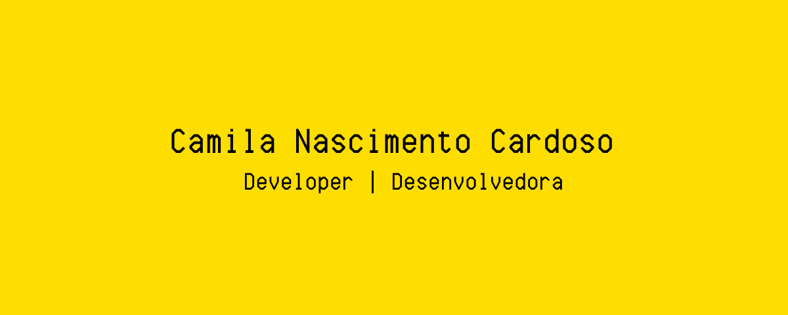

  

## Hi there! </h2>

### Abstract

- 👨‍💻 I'm currently working full-time at **Global Hitss as DevOps**.
- 🌱 Learning more about and studying: **Angular, React, UX/UI e Adobe**.

### Resumo

- 👨‍💻 Eu estou atualmente trabalhando full-time na **Global Hitss como Analista DevOps**.
- 🌱 Aprendendo mais e estudando: **Angular, React, UX/UI e Pacote Adobe**.

### Languages and Tools

 

    
    
    
    
    
    
    
    
    
    
    
     
         

### Find me around the web 🌎:

- 💼 Connecting and sharing professional updates on <a href="https://www.linkedin.com/in/camila-n-cardoso/">LinkedIn</a>.

### Me ache na web 🌎:

- 💼 Conectando e compartilhando atualizações profissionais no <a href="https://www.linkedin.com/in/camila-n-cardoso/">LinkedIn</a>.
